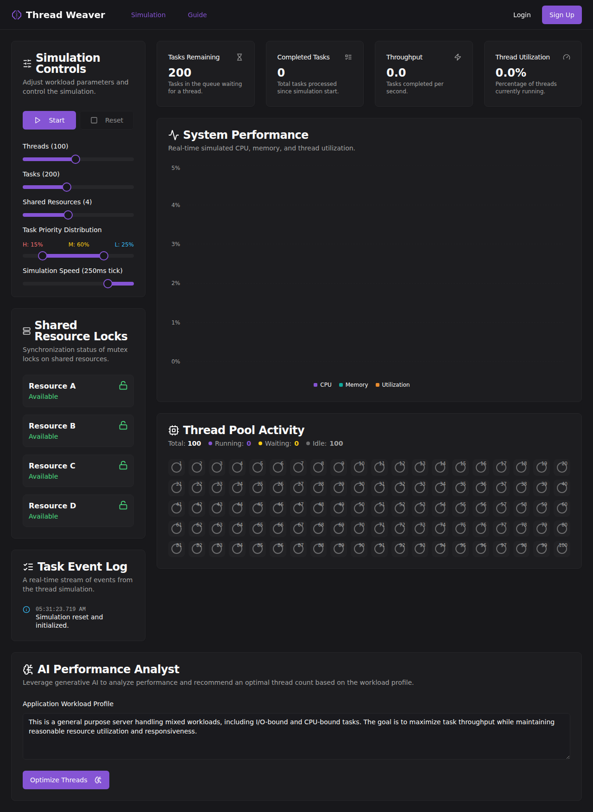

<div align="center">

# 🧵 Thread Weaver

### *High-Performance Thread Pool Simulator*

[](https://github.com/Kartik-Yadav0001/Thread_management/actions/workflows/ci.yml)
[](https://threadmanagement.netlify.app/)
[](https://www.typescriptlang.org/)
[](https://nextjs.org/)

**[🚀 Live Demo](https://threadmanagement.netlify.app/)** | **[📖 Documentation](docs/)** | **[🐛 Report Bug](https://github.com/Kartik-Yadav0001/Thread_management/issues)**

</div>

---

## 📋 Overview

Thread Weaver is an **interactive, real-time thread pool simulator** designed to help developers and students visualize and understand complex multi-threading concepts. Experience the intricacies of concurrent programming through an intuitive dashboard that brings theoretical concepts to life.

### 🎯 Key Highlights

- 🎮 **Interactive Controls** - Dynamically adjust thread count, task load, and resource allocation
- 📊 **Real-time Visualization** - Watch threads work, compete for resources, and complete tasks
- 🤖 **AI-Powered Insights** - Get intelligent optimization recommendations powered by Google Gemini
- 📈 **Performance Metrics** - Monitor CPU, memory, throughput, and utilization in real-time
- 🔒 **Mutex Lock Simulation** - Visualize thread synchronization and resource contention
- 📝 **Event Logging** - Track every significant event in your thread pool

## 🖼️ Screenshots

<div align="center">



*Complete dashboard featuring simulation controls, real-time performance metrics, thread pool visualization, resource locks, and AI-powered performance analysis*

</div>

## ✨ Features

### 🎛️ Simulation Controls
- **Dynamic Thread Pool** - Adjust thread count from 1 to 200 in real-time
- **Configurable Workload** - Set task count and shared resource allocation
- **Task Priority System** - Distribute tasks across High, Medium, and Low priorities
- **Speed Control** - Adjust simulation speed for detailed analysis or quick testing

### 📊 Visualization & Monitoring
- **Thread Pool Activity** - Visual representation of all threads (Running, Waiting, Idle)
- **System Performance Graphs** - Real-time CPU, memory, and utilization charts
- **Resource Lock Status** - Monitor mutex lock states and contention
- **Live Metrics Dashboard** - Track throughput, completion rate, and utilization percentage

### 🤖 AI-Powered Optimization
- **Intelligent Analysis** - AI evaluates your workload profile and system performance
- **Optimization Recommendations** - Get suggestions for optimal thread count
- **Context-Aware Insights** - Recommendations based on I/O-bound vs CPU-bound workloads

### 📝 Event Tracking
- **Real-time Event Log** - Stream of all simulation events
- **Task Lifecycle** - Track task creation, execution, and completion
- **Resource Events** - Monitor lock acquisition and release
- **Thread State Changes** - See when threads start, wait, or terminate

## 🛠️ Tech Stack

<table>
<tr>
<td>

**Frontend**
- [Next.js 14](https://nextjs.org/) - React framework with App Router
- [TypeScript](https://www.typescriptlang.org/) - Type-safe development
- [Tailwind CSS](https://tailwindcss.com/) - Utility-first styling
- [ShadCN UI](https://ui.shadcn.com/) - Beautiful, accessible components
- [Recharts](https://recharts.org/) - Data visualization

</td>
<td>

**AI & Backend**
- [Google Genkit](https://firebase.google.com/docs/genkit) - AI framework
- [Gemini API](https://ai.google.dev/) - Generative AI model
- [Firebase](https://firebase.google.com/) - Backend services

**Development**
- ESLint & Prettier - Code quality
- GitHub Actions - CI/CD pipeline
- Husky - Git hooks

</td>
</tr>
</table>

## 🚀 Getting Started

### Prerequisites

Before you begin, ensure you have the following installed:

- **Node.js** `v18.0.0` or later ([Download](https://nodejs.org/))
- **npm** or **yarn** package manager
- **Git** for version control

### 📦 Installation

Follow these steps to set up Thread Weaver locally:

1. **Clone the repository**
   ```bash
   git clone https://github.com/Kartik-Yadav0001/Thread_management.git
   cd Thread_management
   ```

2. **Install dependencies**
   ```bash
   npm install
   # or
   yarn install
   ```

3. **Configure environment variables**
   
   Create a `.env` file in the project root:
   ```bash
   touch .env
   ```
   
   Add your Gemini API key to enable AI Performance Analyst:
   ```env
   GEMINI_API_KEY=your_google_ai_api_key_here
   ```
   
   > 💡 **Get your API key**: Visit [Google AI Studio](https://makersuite.google.com/app/apikey) to obtain a free Gemini API key

4. **Start the development server**
   ```bash
   npm run dev
   # or
   yarn dev
   ```

5. **Open your browser**
   
   Navigate to [http://localhost:9002](http://localhost:9002) to see the application in action! 🎉

### 🏗️ Build for Production

```bash
npm run build
npm start
```

## 📚 Usage Guide

1. **Configure Your Simulation** - Use the control panel to set thread count, task load, and resources
2. **Start the Simulation** - Click the "Start" button to begin thread pool execution
3. **Monitor Performance** - Watch real-time metrics, graphs, and thread activity
4. **Analyze with AI** - Describe your workload and get optimization recommendations
5. **Review Event Log** - Track all events and understand thread behavior

## 🤝 Contributing

Contributions are welcome! Here's how you can help:

1. Fork the repository
2. Create a feature branch (`git checkout -b feature/AmazingFeature`)
3. Commit your changes (`git commit -m 'Add some AmazingFeature'`)
4. Push to the branch (`git push origin feature/AmazingFeature`)
5. Open a Pull Request

Please ensure your code follows the existing style and passes all linting checks.

## 📝 License

This project is open source and available for educational and personal use.

## 🙏 Acknowledgments

- Built with [Next.js](https://nextjs.org/) and [React](https://react.dev/)
- UI components from [ShadCN UI](https://ui.shadcn.com/)
- AI capabilities powered by [Google Gemini](https://ai.google.dev/)
- Icons from [Lucide](https://lucide.dev/)

## 📧 Contact & Support

- **GitHub Issues**: [Report bugs or request features](https://github.com/Kartik-Yadav0001/Thread_management/issues)
- **Discussions**: [Join the conversation](https://github.com/Kartik-Yadav0001/Thread_management/discussions)

---

<div align="center">

**Made with ❤️ by [Kartik Yadav](https://github.com/Kartik-Yadav0001)**

⭐ Star this repository if you find it helpful!

</div>
